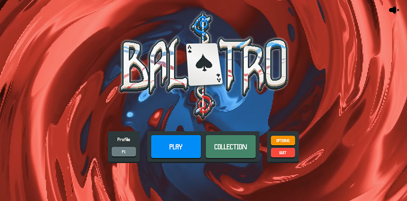
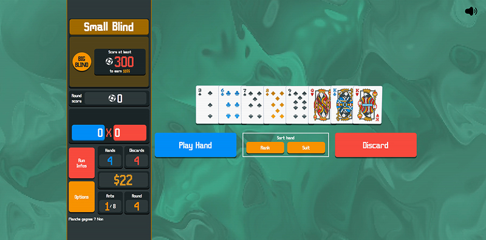

# Balatro
Development of the game "Balatro" in React TypeScript

## To Do
- Add poker hand levels
- On Card click:
  - [x] Refresh the cardsSelected state.
  - [x] Compute a forecasted poker hand using the cardsSelected state.
  - [x] For detecting a Straight: change the order of an Ace if a 2 is present in cardsSelected.
- On Discard button click:
  - [x] Remove selected cards from the current round’s deck.
  - [x] Decrease the number of remaining discards.
  - [ ] Make button unclickable if no discards remain.
- On Play Hand button click:
  - [x] Remove cards from the current round’s deck and add new cards to cardsSelectable.
  - [x] Decrease the number of remaining hands.
  - [x] Calculate hand score: ((combination points + card points) × multiplier) and add it to the round total.
  - [x] Add the point value of each card only if it’s part of a valid combination (returned by getPokerHand()).
  - [ ] End the round if round score >= blind's score objective.
  - [ ] End the round if number of hands left = 0 after scoring.
- On Sort Hand by Value button click:
  - [x] Sort cardsSelectable by value.
- On Sort Hand by Suit button click:
  - [x] Sort cardsSelectable by suit.
  - [ ] Add an orderSuit field to each Card to sort in the order: Spades > Clubs > Hearts > Diamonds.